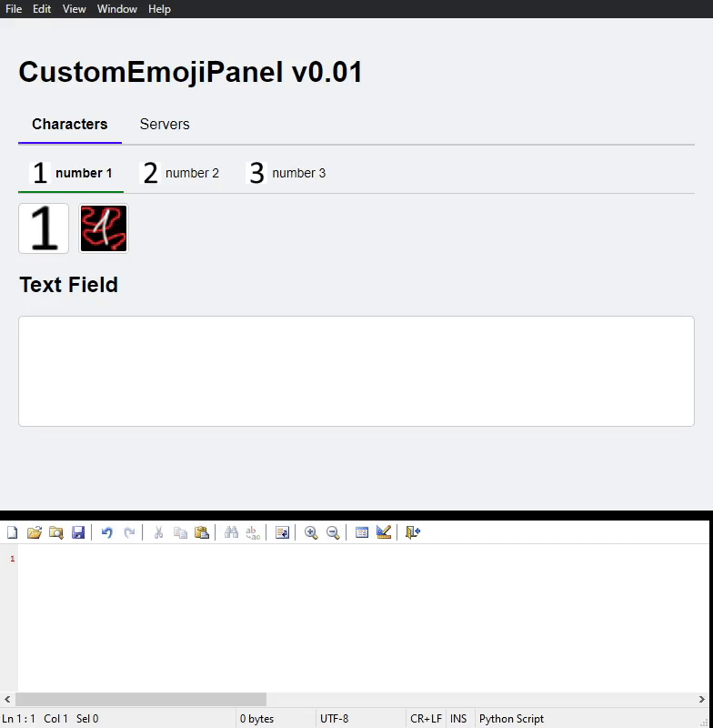

# CustomEmojiPanel by prfDean
Powered by [electron](https://github.com/electron/electron)

A personal project created with assistance from chatgpt, with the specific aim of recreating the functionality of typing and selecting :emojis:, e.g. discord emojis 


1. Create and test emoji combinations based on your personal servers' emojis, or those of your choice
2. Circumvent the locks on emojis in the absence of discord nitro, may require a bot that can convert the :emojis: ( one example is [NQN](https://nqn.blue/) )



to use this for yourself, you need to consider the example folder structure as follows:

## install.bat to install the dependencies ~200mb
## Modify these accordingly, then open run.bat

```
├── img/
│   ├── Characters/         <-- Main category: Characters
│   │   ├── number 1/       <-- Subcategory "number 1"
│   │   │   └── 1.png       <-- icon and name of the emoji
│   │   ├── number 2/       
│   │   │   └── 2.png       
│   │   ├── number 3/       
│   │   │   └── 3.png
│   └── Servers/            <-- Main category: Servers
│       ├── simple/         <-- Subcategory/Server name
│       │   └── 1.png
│       │   └── 2.png
│       │   └── 3.png
│       └── advanced/       
│           └── 1_2.png
│           └── 2_2.png
│           └── 3_2.png
└── tabicons/
    ├── characters/         <-- Icons for the "Characters" Category
    │   ├── number 1.png    <-- Icon for the "number 1" subcategory, uses the same name as the folder
    │   ├── number 2.png    
    │   ├── number 3.png    
    └── servers/            <-- Icons for Servers subcategories
    │   ├── simple.png      <-- Icon for "simple" tab
    │   └── advanced.png    <-- Icon for "advanced" tab
```


# Current supported platform : **Windows**

Ideas to consider for the future:
- themes
- additional compatibility across platforms or software
- ...
- ...
  
  
